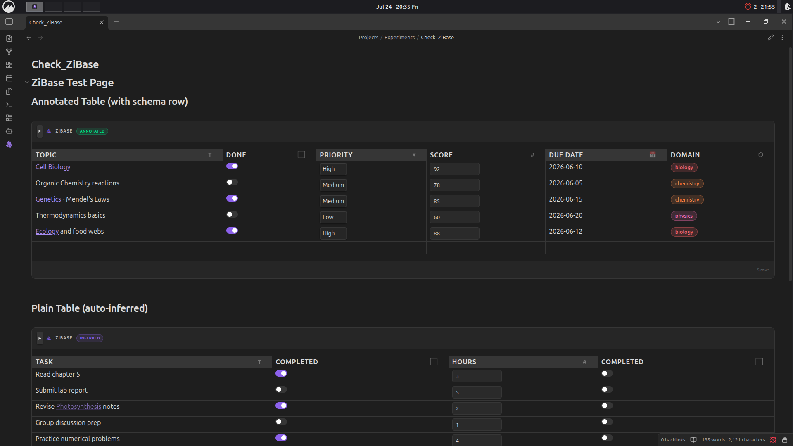
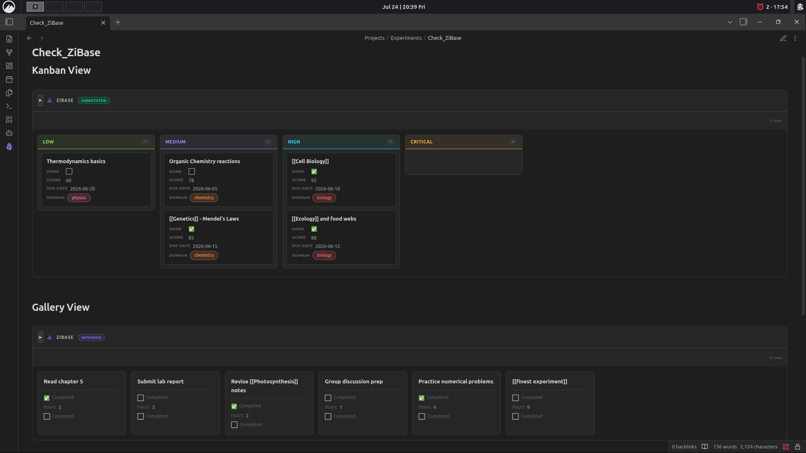
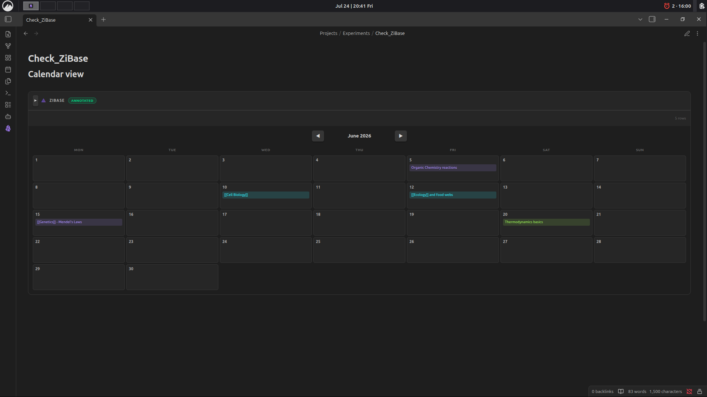

# ZiBase

**Markdown tables as living databases — for Obsidian.**

[](https://github.com/sponsors/Rohith-AM)

ZiBase turns an ordinary markdown table into a rich, interactive database view: sortable/filterable columns, Kanban/Gallery/Calendar layouts, drag-and-drop, formula columns, and inline editing — all while your data stays as plain, portable markdown. No extra files, no proprietary format, no lock-in.

Built from scratch under [ZIYAL (ழியல்)](https://github.com/rohith-am).

## Screenshots


*Annotated table with custom column types (Toggle, Select, Number, Date, Label) and auto-inferred plain table.*


*Kanban view grouped by priority, and Gallery view for quick card-based browsing.*


*Calendar view automatically generated from a Date column.*

---

## Features

- 📊 **Multiple views** — Table (default), Kanban, Gallery, and Calendar, switchable per-table
- 🖊️ **Inline editing** — Alt+Click any cell to edit in place, even rendered links/wikilinks
- 🧮 **Formula columns** — reference other columns by name (e.g. `Price * Qty`), no `eval()`, powered by a safe recursive-descent expression parser
- 🏷️ **Typed columns** — Text, Toggle, Select, Label, Number, Date, Formula
- 🔍 **Schema inference** — works on plain tables with zero setup; auto-detects column types from content
- 🗂️ **Kanban view** — group by any Select/Label column, drag cards between lanes
- 📌 **Zero extra files** — everything lives in the markdown table itself, using HTML-comment annotations Obsidian already ignores in Reading View

---

## Installation

1. Open **Settings → Community Plugins** in Obsidian
2. Disable Safe Mode (if prompted) and click **Browse**
3. Search for **ZiBase** and click **Install**, then **Enable**

*(Manual install: copy `manifest.json`, `main.js`, and `styles.css` into `<vault>/.obsidian/plugins/zibase/`, then enable it from Community Plugins.)*

---

## Usage Guide

### 1. Start with any markdown table

ZiBase renders **any** table in Reading View — even a plain one with no annotations. Column types are auto-inferred from the header name and content (e.g. a column named `status` becomes a Select column; `done`/`completed` become a Toggle; `tag`/`tags`/`category`/`label` become Label columns).

```markdown
| Task                  | Completed | Hours | Category   |
| ---------------------- | --------- | ----- | ---------- |
| Read chapter 5         | true      | 3     | Study      |
| Submit lab report      | false     | 5     | Assignment |
```

### 2. Add an explicit schema row for full control

For precise typing, add a **schema row** as the 3rd line of the table (right after the header separator), with one annotation comment per column:

```markdown
| Topic          | Done                        | Priority                               | Score                       | Due Date                  | Domain               |
| -------------- | --------------------------- | --------------------------------------- | ---------------------------- | -------------------------- | --------------------- |
| <!-- zibase: text --> | <!-- zibase: toggle --> | <!-- zibase: select:Low,Medium,High,Critical --> | <!-- zibase: number --> | <!-- zibase: date --> | <!-- zibase: label --> |
| Cell Biology   | true                         | High                                     | 92                            | 2026-06-10                  | biology                |
```

**Available column types:**

| Type      | Annotation                              | Notes                                  |
|-----------|------------------------------------------|-----------------------------------------|
| Text      | `<!-- zibase: text -->`                  | Renders markdown, wikilinks included    |
| Toggle    | `<!-- zibase: toggle -->`                | `true` / `false` → checkbox             |
| Select    | `<!-- zibase: select:Opt1,Opt2,Opt3 -->` | Dropdown with fixed options             |
| Label     | `<!-- zibase: label -->`                 | Colored chip, auto-colored per value    |
| Number    | `<!-- zibase: number -->`                | Right-aligned, sortable numerically     |
| Date      | `<!-- zibase: date -->`                  | `YYYY-MM-DD`, used for Calendar view    |
| Formula   | `<!-- zibase: formula:Price * Qty -->`   | Reference other column names directly  |

### 3. Switch views

Add a view annotation on its own line, right before the table (or use the view-switcher icons in the table's toolbar — this writes the annotation for you):

```markdown
<!-- zibase-view: kanban:Status -->
| Task | Status | Priority |
...
```

- `<!-- zibase-view: kanban:ColumnName -->` — Kanban board grouped by a Select/Label column
- `<!-- zibase-view: gallery -->` — card gallery
- `<!-- zibase-view: calendar -->` — calendar grouped by a Date column
- No annotation — default Table view

### 4. Editing

- **Alt+Click** any cell to edit it in place — works even on rendered links/wikilinks
- **Kanban**: drag a card between lanes to update its grouping column
- **Add row**: use the "+ Add row" button at the bottom of the table
- All edits write straight back to the markdown table — your file stays the single source of truth

### 5. Formula columns

Formula columns reference other column names directly (case-insensitive), no cell syntax like `=A1*B2`:

```markdown
<!-- zibase: formula:Price * Qty -->
```

---

## Notes & Limitations

- Reading View only (Live Preview support not yet available)
- Desktop and mobile compatible (`isDesktopOnly: false`)

## Feedback / Issues

Please open an issue on the GitHub repo with a minimal example table if you hit a bug — screenshots of Reading View + the raw markdown source are the fastest way to get it fixed.

## Support

ZiBase is built solo as a passion project. If it saves you time or makes your Obsidian vault feel a little more alive, consider sponsoring — it genuinely helps with university expenses and keeps the motivation going! 🙏

[](https://github.com/sponsors/Rohith-AM)

Completely optional — even a ⭐ star on the repo means a lot!

## License

MIT — see [LICENSE](./LICENSE)
